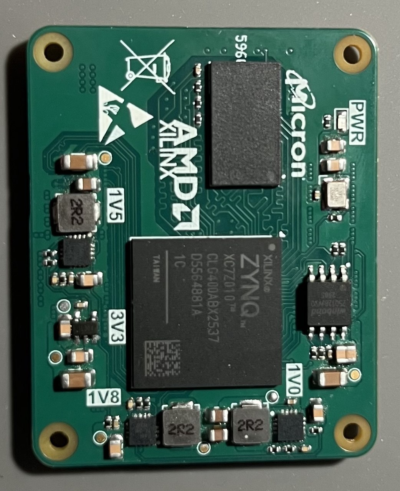
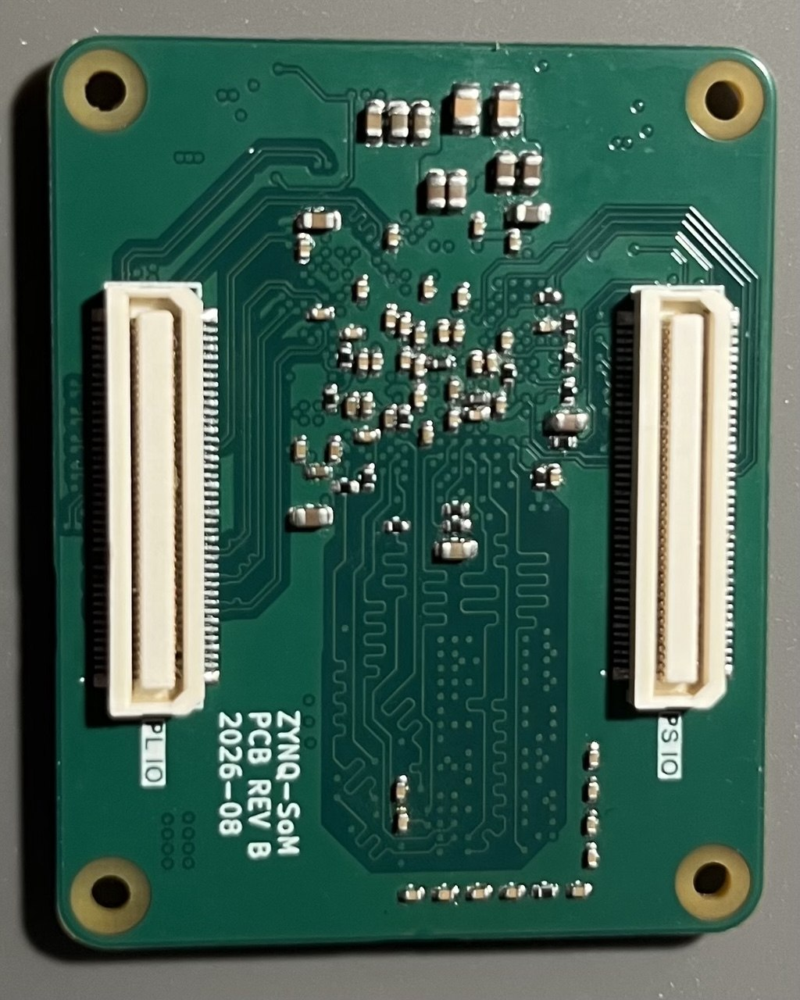

# ZYNQ-SoM

An open-source Zynq-7000 system-on-module, designed in KiCad. The Rev B boards have been assembled and tested.

## Photos





## What is on the board

- AMD/Xilinx XC7Z010-1CLG400C
- 512 MiB DDR3 (Micron MT41K256M16)
- 32 MiB QSPI NOR flash (Winbond W25Q256)
- 33.3333 MHz PS reference clock
- Two Panasonic AXK580137YG 80-pin board-to-board receptacles
- 50 mm × 40 mm, 6-layer PCB
- Separate PL Bank 34 and Bank 35 I/O voltage inputs
- 5 V module input with on-board power rails

The bottom-side silkscreen labels the connectors `PL IO` and `PS IO`. J402 carries PS MIO, configuration/JTAG, and PL Bank 35. J403 carries PL Bank 34 and module power-related pins.

## Files

```text
hardware/kicad/        KiCad project, schematic, PCB, symbols, footprints, and 3D models
docs/                  Schematic PDF, schematic page images, photos, and connector lengths
production/bom/        BOM exported from KiCad
production/gerbers/    Gerber and drill files
```

Open [hardware/kicad/ZYNQ-SoM.kicad_pro](hardware/kicad/ZYNQ-SoM.kicad_pro) with KiCad 10.0 or newer. Project symbols, footprints, and 3D models are referenced relative to `${KIPRJMOD}`, so no global custom-library setup is required.

## Useful files

- [SoM connector routing lengths](docs/connector-routing-lengths.md)
- [Machine-readable routing lengths](docs/connector-routing-lengths.csv)
- [Schematic PDF](docs/ZYNQ-SoM-schematic.pdf)
- [Gerber ZIP](production/gerbers/ZYNQ-SoM.zip)
- [BOM](production/bom/ZYNQ-SoM.csv)

The connector length table is for carrier-board length matching. It uses KiCad Net Inspector style lengths for the SoM-side routing; connector contact length and carrier-board routing are not included.

## Notes

- The checked-in Gerbers are the fabrication files for this revision.
- Review the KiCad source before ordering boards or changing parts.

## License

Released under the CERN Open Hardware Licence Version 2 - Permissive (`CERN-OHL-P-2.0`). See [LICENSE](LICENSE).
